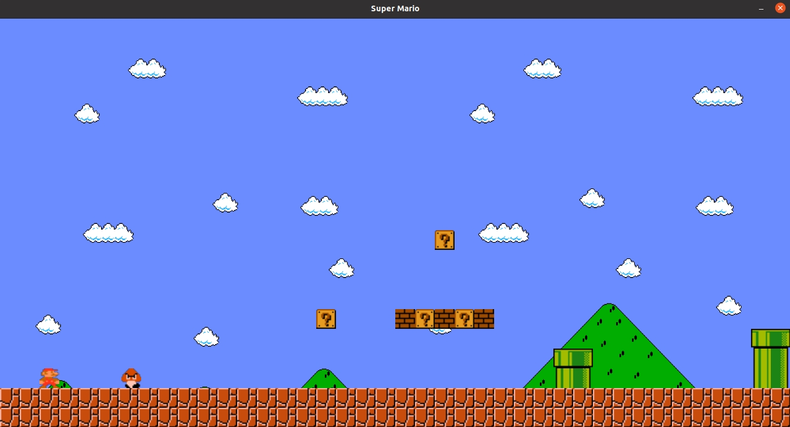

# Super Mario

## Description

This is clone of Super Mario Game written with [RSDL](https://github.com/UTAP/RSDL) (SDL2 Wrapper). Note that using inheritance and polymorphism was forbidden for this project, which made it a bit messy.

<p align="center">
  
</p>

## How to play

Compile the project using makefile. run the game with name of the level as argument.

```bash
./output.out 1.txt
```
